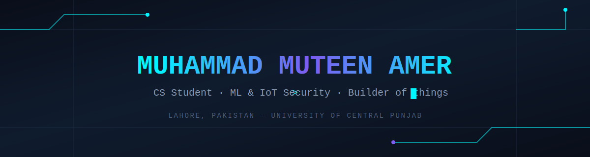
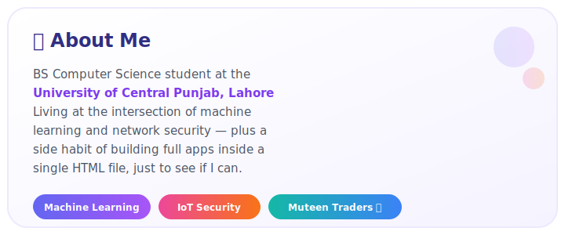
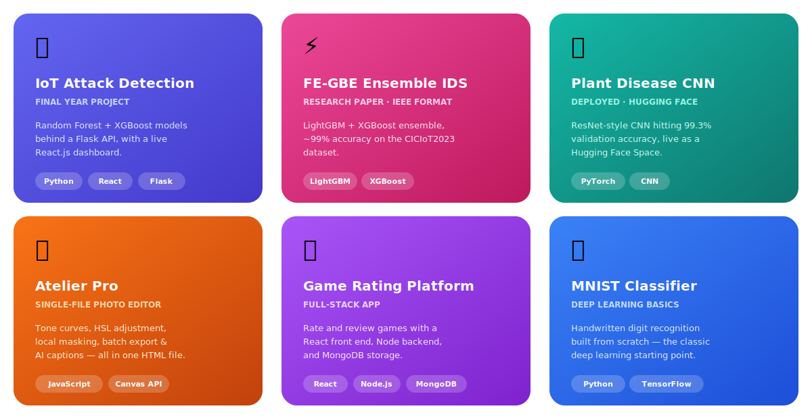

  

  
  

 

  

 

## 🚀 Featured Projects

  

 

## 🛠️ Tech Stack

  

 

## 📊 GitHub Stats

  
  

  

 

## 🐍 Contribution Snake

<!--START_SECTION:snake-->
<picture>
  <source media="(prefers-color-scheme: dark)" srcset="https://raw.githubusercontent.com/MuteenAmer/MuteenAmer/output/github-contribution-grid-snake-dark.svg" />
  <source media="(prefers-color-scheme: light)" srcset="https://raw.githubusercontent.com/MuteenAmer/MuteenAmer/output/github-contribution-grid-snake.svg" />
  
</picture>
<!--END_SECTION:snake-->

 

  

